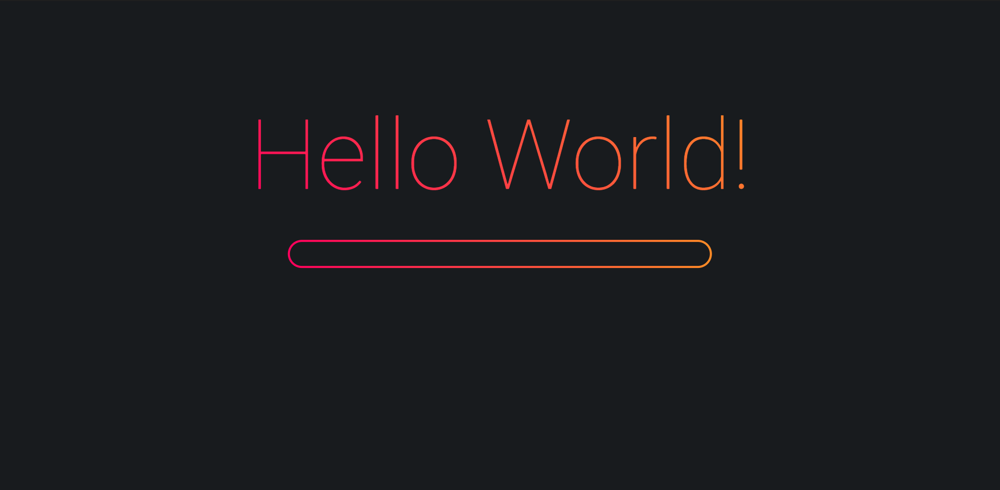
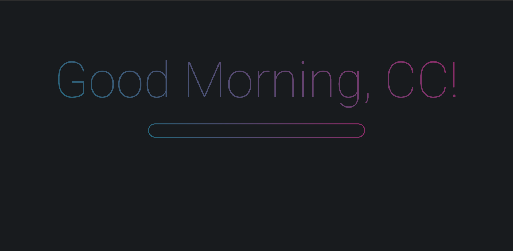

# Mars-Startpage

A Firefox startpage inspired by Sweet KDE theme.  
Fully Configurable, see [configuration](#Configurable).

### Screenshots

Default
  
Different Gradient with a different greeting.  

### Configurable

There's three places to configure it: `public/global.css` (to set your background colour), `src/App.svelte` (see `:root` in `<style />`) and in `config.yaml`.
